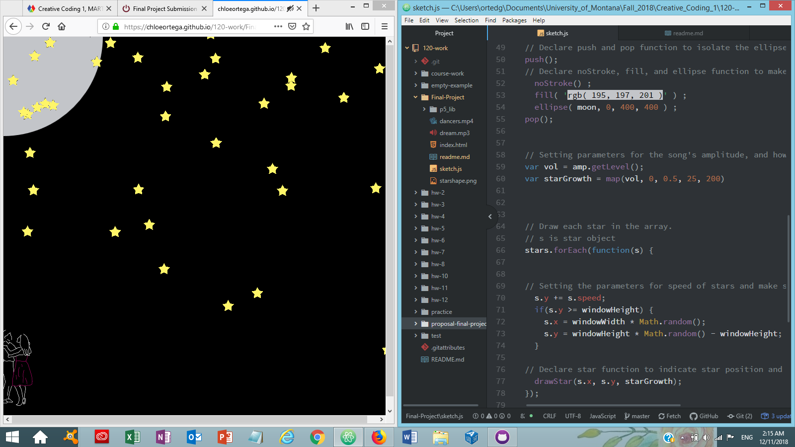

# Chloe Ortega, Group C

[Final Sketch: Dream a Little Dream of Me](https://chloeortega.github.io/120-work/Final-Project/)

## Final Project, Final Week Breakdown

### *Introduction: So the time has ended...*

This was the final week to work on our final project, I was excited to push myself in the beginning but coming to this point I didn't know how anxious I would feel about it and how many times I would have to rework code.

In my original proposal I stated **"I want to create a musical night scene with objects(moon and stars) and the silhouette of a couple dancing animation. The stars would "twinkle" (move/rotate, within a fixed position up and down or increase then decrease in diameter) to the melody of "Dream a Little Dream of Me" by Ella Fitzgerald and Louis Armstrong, there will be a moon ellipse that will move across the canvas while moving to the melody of the music as well. While the moon and stars continue to move with the melody of the song, there will be an animation of a dancing couples silhouette. If I have the time I would also like to make the stars able to interact with the user maybe by allowing the user to click on them, drag and release them so they will move confined in the canvas parameters and if they come in contact with each other or the moon then they will change color."** Oh how I wish I would have known how much I bit off.

### *Issues*

In the beginning I knew I would run into "a bundle of issues", but little did I know it was going to be several bundles. I started out initially rereading my notes from class and going over the videos in the classes material. I then rewatched many of Daniel Shiffman's videos, starting with his [Custom Shapes](https://www.youtube.com/watch?v=76fiD5DvzeQ&t=612s), this is where I started when I made my inital star, it resembled one at least. From there I completed rough sketches to use for my animation using sprites talked about in the classes material. I watched Daniel Shiffmans [Uploading Media Files](https://www.youtube.com/watch?v=rO6M5hj0V-o&t=49s) and reviewed the course material on how to upload an image.

I then started to work on uploading the song I watched Daniel Shiffmans[Loading and Playing](https://www.youtube.com/watch?v=Pn1g1wjxl_0&t=13s). I ran into my first major issue, my `loadSound` was not being defined. I looked into the class issues forum and seen others had problems as well, luckly there was information about the html file and the script, so I was able to have my sound working after a few days.

From there I was getting so frusterated with the sprites, so I decided to work around my problem and make a short video using rotoscoping in photoshop that I would loop and import into the sketch, this is where I came to the biggest issue. I had seen on the course website that we would be able to use video, so I looked on the p5.js reference page and was able to figure out how to import my video, but I did not notice that it had mentioned that the video doesn't exist on the sketch you have to put it there. This took me forever to figure out, finally I was able to use a variable and use the `hide()` function to the draw the video onto my sketch. I also had to work out the code in order to resize it because my video was huge, I didn't think that it would be that big.

My next issue was I didn't like my initial object that only resembled a star that I had made from code, so I decided to work around that and use a star shape that I made in photoshop. There were many other things that went wrong, code not being in the right place, many white screens coming up on my browser, my computer struggling to run multiple applications to work on the code and also reseach on how to fix my code.

### *Work*

My code mainly consists of variables and arrays, I was able to use the `preload()` function in my sketch to make sure the song, video, and image were loaded. I was able to set my volume for the music and use the amplitude of the song to change the size of my star, I was able to figure this out watching Daniel Shiffman's [Amplitude Analysis](https://www.youtube.com/watch?v=NCCHQwNAN6Y). It took me so long to figure out the right parameters to give my song, video, and star. I was able to resize my video and move it to my desired location. In the end I also decided to leave my moon fixed in one place. I also found out that viewing my work in different browsers displays different results. Below is a sample of my code and a screenshot of my final sketch.

### *Final Progress and Final Thoughts*

Overall I enjoyed this class and I am happy with what I was able to learn. For this final project I under estimated the time that it would take me to make my code work. I was not able to make anything interactive for the viewer because I was too focused on trying to make the first part of my initial idea work. Although I am happy with what I was able to accomplish in this sketch, I think I could have pushed myself more especially if I would have been on campus and been able to recieve help from the Lab Assistants or fellow classmates or teachers face to face because that is how I learn best. I want to keep practicing and failing and practicing some more at coding because I know that this will benifit me greatly in me being able to make what I want to make in future work.
