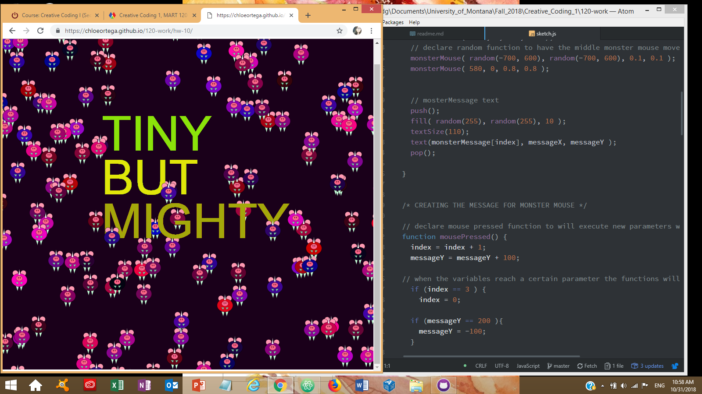

# Chloe Ortega, Group C

[Mini Monster Sketch](https://chloeortega.github.io/120-work/hw-10/)

## Homework 10 Cycle Breakdown

### *Introduction*

I enjoyed this weeks homework cycle and material, we had the choice to either make a new sketch or revisit a sketch we had previously done and adapt it to use arrays and new functions.I decided to revisit week 4 and use the code for my monster sketch and revamp him. In order to achieve the look that I wanted and adapt the code I mainly focused on utilizing arrays, `random()` function, `text()` function, `mousePressed()` function, `translate()` function, `scale()` function, and giving new variables and parameters.

### *Issues*

This week I encountered a few minor issues, including my text not displaying and the text not returning when I wanted it too. In order to work through these minor issues I did the following:

- Reread though week 9 material and week 10 material
- Watch Daniel Shiffman's YouTube videos again on Arrays and Functions
- Trial and Error with my code

I was able to solve my minor issues by spending more time on my sketch discovering what parameters I had to give and coming back to order of operation.

### *Work*

Below is a sample of code I used in order to adapt my monster sketch using the `random()` and `mousePressed()` along with a screen shot of my final sketch.

### *Progress and Final Thoughts*

With this completion of week 10 I was excited with the material as it gave more ways to utilize our code to make it easier to work with and manipulate it to do what we want it to do. Unfortunately I was not able to help any of my fellow classmates with any of the issues on the forum, hopefully next week I will be able to help someone or post to the forum with problems I am having as to engage with the class.

In summation, I do feel the pressure beginning to build as the final project comes closer, it's exciting to be able to utilize all of the material we have learned thus far but it is daunting to think about. I will keep practicing the material we have covered over this semester and work harder in the following weeks material as always.
