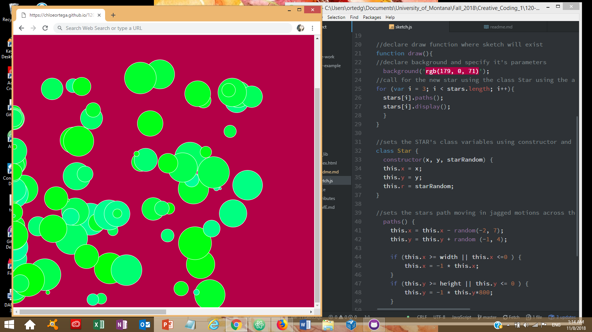

# Chloe Ortega, Group C

[Falling Drops Live Sketch](https://chloeortega.github.io/120-work/hw-11/)

## Homework 11 Cycle Breakdown

### *Introduction*

I enjoyed this homework cycle we were introduced to *OOP* **Object Oriented Programming** where an object is made from code that gives us the attributes of the object and how they can behave. We were tasked this week to create a sketch that utilizes *OOP* and let our made objects have their own special characteristics. My sketch reminded me of beads of raindrops moving across a windshield when you are driving. In order to complete this weeks assignment I utilized the constructor method to make my object, `frameRate()` function, `mousePressed()` function, `random()` function, and arrays.

### *Issues*

This week I did encounter some issues, my first initial idea for a sketch was to have falling stars called each time the mouse was pressed but I couldn't exactly get it the way I wanted to. I reformulated my plan of attack and thought of the raindrops moving across a moving cars windshield aesthetic. With this I did run into a few minute issues including how I would make the raindrops gather at one side of the screen but disappear off the bottom of the canvas. In order to work around my issues I took the following steps;

- I reread through the weeks material
- Spent more time watching Daniel Shiffman's coding videos on YouTube
- Researched on Google
- Looked on the class issues forum
- Spent time working on my sketch and playing with different parameters

I was able to solve my problem by switching some parameters around in my sketches move area.

### *Work*

Below is a sample of my code and a screenshot of my final sketch.

### *Progress and Final Thoughts*

This felt like a solid work week to me I was happy I was able to solve my minute issues and now I have another idea ready to go when the next homework cycle comes around. Being able to make the code easier to read and execute has helped me alot when I think about the final project and the ideas what I was to accomplish with that. I was unable to help any classmates on the issues forum but I look foward to giving some positive feedback on the sumbission forum and I want to take the initiative to start a discussion about the final project since it is coming closer.

Overall, I am happy with what I have learned in the class thus far and I look foward to keep pushing myself in coding!
