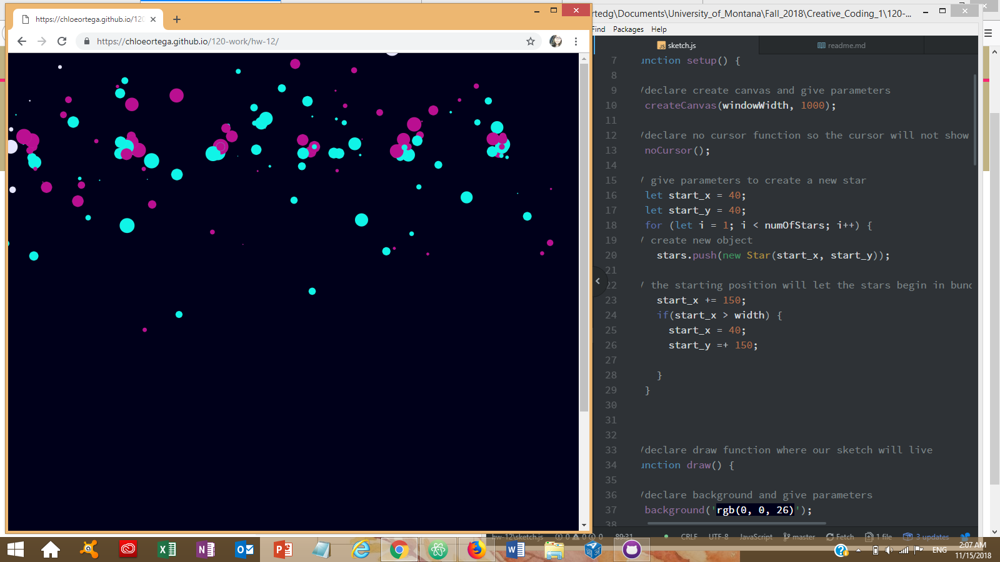

# Chloe Ortega, Group C

[Bursting Drops Live Sketch](https://chloeortega.github.io/120-work/hw-12/)

## Homework 12 Cycle Breakdown

### *Introduction*

I enjoyed this cycles homework we were introduced to how to make objects aware of each other so they would interact with one another. We were tasked with making a class or multiple classes aware of each other and have them interact to do something. My sketch reminded me of confetti with a birthday party aesthetic. In order to complete this weeks assignment I utilized the constructor method to make my object, `random()` function, `mouseIsPressed`, arrays, and many changing parameters.

### *Issues*

This week I did encounter some minor issues regarding the parameters of some of my functions. I wanted the confetti particles to bounce off the left and right border of the canvas and move past the top and bottom canvas border. In order to work around my issues I took the following steps;

- I reread through this week and last weeks material
- Spent an extensive amount of time watching Daniwl Shiffman's coding videos on YouTube
- Researched on Google
- Used the Reference page on the p5.js website
- Spent more time inputting different parameters

I was able to solve my problem by switching some parameters around in my sketches paths section.

### *Work*

Below is a sample of my code and a screenshot of my final sketch.

### *Progress and Final Thoughts*

I was happy with how the final sketch turned out and how I was able to get my sketch do what I wanted it to do. I was not able to help in any of the problem shooting in the class issues forum but I look forward to giving some positive feedback for the class, I also would like to post a discussion for ideas for the final project. I have been giving my final project some thought about what I could do, I was reading it has to be equivalent to three weeks worth of work, so I'm working on taking one of my ideas and building upon it's theme.

In summation, I look forward to moving into the final project and utilizing all the material I have learned and working with fellow students in the class issues forum to achieve our final project goals.
