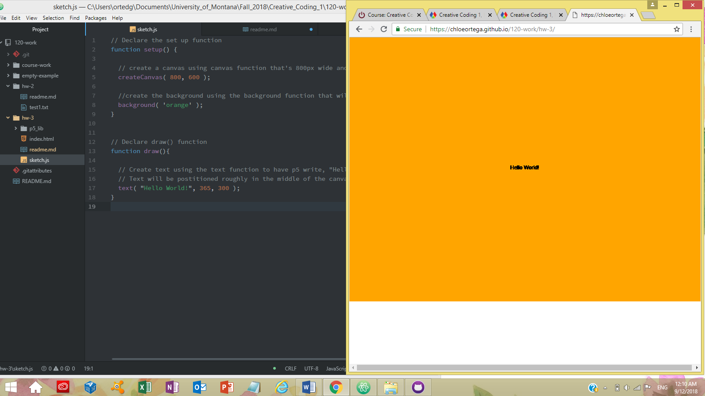

# Chloe Ortega

[Hello World!" Sketch](https://chloeortega.github.io/120-work/hw-3/)

## Homework 3 Breakdown

### *Introduction*

This week was very exciting with the introduction of p5.js and the creation of my first sketch announcing Hello World to the internet community. We got introduced to some of the basic programming functions for p5.js. I really enjoyed the opportunity to use the `createCanvas` function and `background` function to play around with different parameters and pick a color for the canvas.

### *Issues*

This homework cycle I didn't run into any problems with the homework of creating a p5 sketch itself. Although there are two issues that I came across. One is making me question my Atom's project directory, in the project directory I have two folders that I think shouldn't be there, one is **.git** the other is **.gitattributes**. I don't know if this is anything that I should be concerned about if they will cause future problems in my homework or they will be fine where they are.
Another minor issue that I had is with the **Weekly Homework Questions**, last week there were rather specific write up parameters concerning the markup-syntax and how we should have at least one of each of the elements listed. This week it felt more lenient, I was just curious about if we should still follow last weeks markup-syntax parameters, maybe I'm thinking too much into this, but I will more than likely post to the issues form and see if any of my classmates had simular questions.

### *Work*

Below is a screenshot to my work this week including the functions `setup`, `createCanvas`,  `background`, `draw`, and `text` function to create my final sketch.js. I went with orange because it reminds me of fall time.

### *Progress*

So far in this class I am getting more comfortable talking with my computer and playing around with different commands and functions. I've been rereading and going over tutorials to help get me more familiarized with working and problem solving, I hope as the weeks keep progressing I will be able to keep improving to help in the issues form, and be comfortable posting an issue if I have one.

## *Final Thoughts*

Week three's homework and materials were inspiring to me because it's taking the baby steps into being able to create art and interactive technology to share information with the world. Especially watching the [p5.js "Hello" Video page](http://hello.p5js.org/) it was entertaining and exciting to see that with hard work and continuation in coding I can make material like the ones featured to help with my career goals.
