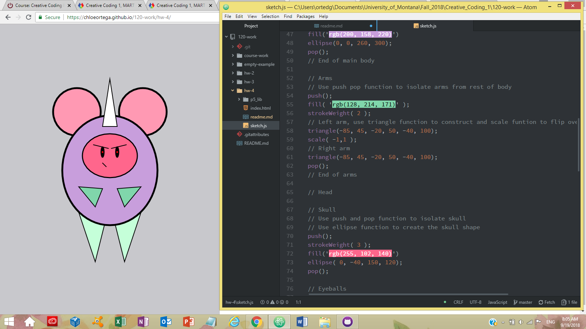

# Chloe Ortega

[My Monster! Sketch](https://chloeortega.github.io/120-work/hw-4/)

## Homework 4 Breakdown

### *Introduction*

This week was really entertaining being able to play with sketch.js and create a monster or a self portrait. I chose to make a monster, maybe in the future I will try to create a self portrait because I think that would be useful as a profile picture. My monster came out looking like a tiny but mighty plump mouse with a horn complimented by angry eyes and eyebrows. This week we added upon our growing list of functions including `arc()`, `translate()`, `rotate()`, `scale()`, `push() & pop()`, `ellipse()`, `line()`, and  `triangle()`. I used the `push() & pop()` functions to break up my monster into it's body parts and that helped me stay focused on one section at a time. I also heavily used the `ellipse()` and `triangle()` functions to construct the majority of my monsters body parts.

### *Issues*

This weeks homework presented me with some minor issues including:
- Confusion with the `translate()` function
- p5 reference website not working
- Confusion plotting points on a graph
- Second guessing myself on how to upload my work

In order to work though these issues I watched some of *Daniel Shiffman's* videos on his **Coding Train** channel on youtube, worked through my chapters in *Make: Getting Started with p5.js* book, refreshed with last weeks homework material, and refreshed with graphing. I plan to post on the issues board to ask my fellow classmates advice on which browser to run the p5 website in and see if anyone is having any other simular issues. I would like to be apart of an in person study group like some have suggested but I live about 8 hours away from campus.

### *Work*

Below is a screenshot of this weeks homework showing some of my code for my monster and my final monster sketch. Here you can see where I used `ellipse()`, `push() & pop() `, `triangle()` functions and `//comments` explaining what is happening at each section. I did download the *color picker* package into Atom but I decided to use a [color picker online](https://www.w3schools.com/colors/colors_picker.asp?color=80ced6) because the way it was broken down made it easier for me to pick out colors I wanted to try and create a decent color palette.

### *Progress*

Thus far in this class I feel comfortable with using some of the functions and writing comments in my line of code, but I still need to work on not second guessing myself and I need to keep reviewing the material we have gone over.

### *Final Thoughts*

This weeks assignment was very exciting to create something from our imaginations, I'm happy to be learning the material. I know that comprehending the basics will be fundamental to producing successful future projects so I need to study more, but also be kinder to myself when I do make mistakes like our good instructor has been saying to us, easier said than done sometimes.
