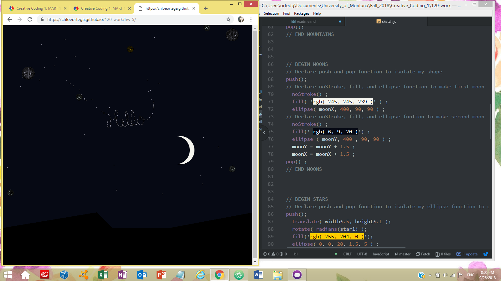

# Chloe Ortega

[Starry Moon Night! Live Sketch](https://chloeortega.github.io/120-work/hw-5/)

## Homework 5 Breakdown

### *Introduction*

I loved this weeks material and the small moving animation I decided to create! We could have made another monster sketch that moved or another idea, I decided to create a night landscape with rotating stars, a moon that moved across the screen, and a small "star" that followed the mouse and left a trail of stars, essentially letting the viewer draw their own stars to decorate the sky. I think that I will try and remake more versions of my monster from homework four and make them move using their little legs in my free time. This homework cycle we again added upon our growing inventory of functions including the `frameRate()` function. This week we mainly focused on variables, how to declare variables, how to initialize those variables, and how to write more readable code. Some variables we learned were *let*, *mouseX* and *mouseY*. I used *camelCase* in order to name my variables and used *let* to declare my variables. I also decided to declare my `background()` function inside my `setup()` function so every frame would not erase so my `ellipse()` function would trail my mouse and leave a trail of "stars".

### *Issues*

This homework cycle I had only a small issue, I wanted to have my `moonX` travel across the computer screen window width not leaving it's frames behind, while also having my smaller ellipse that was following my cursor leave a trail of smaller ellipses when you moved the cursor around, to allow the user to decorate the sky with stars. If I declared my `background()` function in the `draw()` function then I would achieve the `moonX` moving across the screen but there would only be a small ellipse following the cursor with no "trail". If I declared my `background()` in my `setup()` then I would get a trail of small ellipses following my cursor but my `moonX` would also have it's frames showing across the screens width.

In order to work through this issue I did the following:

- Googled the problem
- Watched Daniel Shiffman's [9.7: Drawing Object Trails](https://www.youtube.com/watch?v=vqE8DMfOajk)
- Posted on the class issues forum
- Bounced ideas off of a former instructor

I did try the ideas in Daniel Shiffman's video but I didn't quite comprehend what I was trying to do so I decided to leave that for the future. I did recieve some feedback on the issues forum from two wonderful classmates, one classmate suggested I use the `split()` function, I will try this out when I have free time. I ultimately decided to go with another idea I came up with while I bouncing ideas off of a former instructor. In order to accomplish both desired outcomes of my ellipses, I declared `noStroke()`, declared my `background()` function in my `setup()` function so it would show the frames of my small ellipse following my cursor to show its trail, then I added another ellipse I named `moonY` and used the `fill()` function to set it as the background color. I set it to move a little later than `moonX` and overlapped it a little so `moonY` would recolor the white frames of `moonX` with the dark blue background color. Another way of describing it is I made `moonY` clean up after `moonX`. My "full moon" moving across the sky became a "cresent moon" moving across the sky.

### *Work*

Below is a screenshot showing some of my code for my animation and my final *Starry Night Sketch*. You can see some of my functions and comments, particularly how I made my "cresent moon" move across the sky without showing any of the trailing frames. I also drew a friendly *Hello* to the viewers on my sketch screenshot, points to me for making it legible; I think, unless you have a hard time reading cursive.

### *Progress*

Thus far in week five I have become comfortable asking for help on the issues forums and I do believe I am progressing well enough in the class. I am quite proud of myself for coming up with an alternative solution to my issue in this weeks homework cycle, it took some work but it turned out well. I am also very happy that my classmates were willing to help me out as much as they could with suggestions on the issues forum. I still need to reread and play with making shapes to feel more comfortable graphing points.

### *Final Thoughts*

Over all this week so far was the most exciting for me because of the idea I came up with and the solution I thought of to the issue I was having. The issue did make me more motivated to play more and find alternative solutions to problems that may arise but it made me want to comprehend these functions we have learned even better so I can start learning more advanced functions to accompany them.
