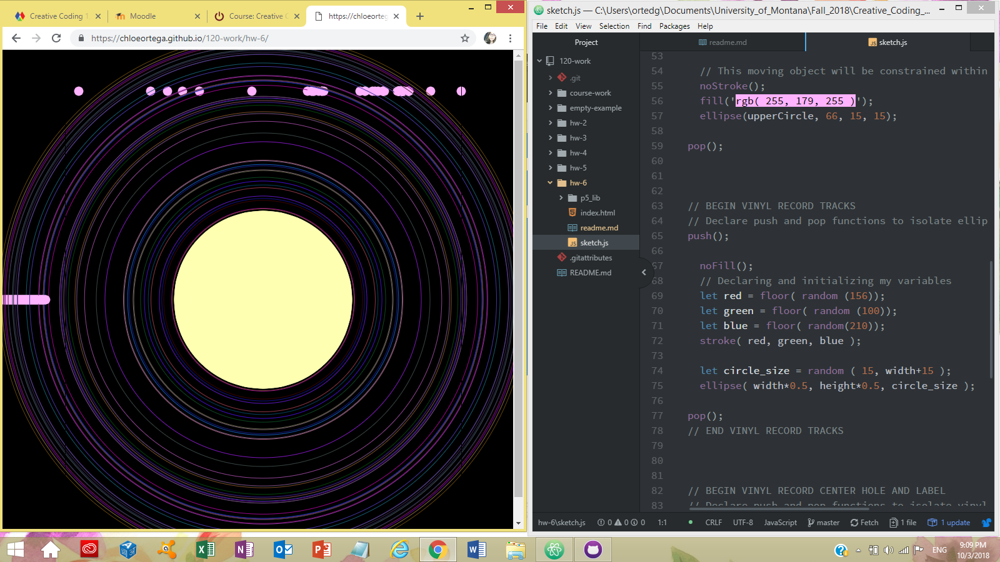

# Chloe Ortega

[Algorithmic Live Sketch](https://chloeortega.github.io/120-work/hw-6/)

## Homework 6 Cycle Breakdown

### *Introduction*

I enjoyed this weeks material and expectations
for the small algorithmic sketch we needed to create. I decided to make a sketch that would create my interpretation of a vinyl record complete with a needle. This week we mainly focused on math, introducing more operators to use including `*` *multiplication*, `%` *modulo*, and `**` *exponentiation*. We also introduced math functions including `abs()`, `floor()`, `round()`, and `sqrt()`. In order to create my sketch I decided to use a variety of functions but I mainly focused on `floor()`, and two new functions `map()` and `random()`. I also decided to declare my `background()` function in my `setup()` function to create my desired effects of my `ellipse()` functions.

### *Issues*

This week I encounter an issue involving one of my ideas to have an ellipse travel across the **windowWidth** at a multiplication of two. When I would minimize the window screen to half screen so I could work with Atom on the right hand side of the screen my code worked, but when I would refresh my screen to full screen it wouldn't work and would only display three ellipses. In order to try and resolve this problem I did the following:

- Google the problem
- Watched some Daniel Shiffman's Coding Train videos on YouTube, including [Modulo Operator with Golan Levin](https://www.youtube.com/watch?v=r5Iy3v1co0A&feature=youtu.be)
- Posted to the classes issues forum

I tried different ways to achieve my desired outcome, and I've been waiting on a reponse on the issues forum to see if anyone has any input. I decided to omit that part of the code and replace it with something else in my sketch. I will continue to look at the issues forum and work on this part of the code in my free time.

### *Work*

Below is a screenshot of my code for my *Vinyl Tracks* showing the `floor()` and `random()` function I used to achieve my desired look and my final *Vinyl Record - Algorithmic Sketch*.

### *Progress and Final Thoughts*

With the completion of week 6 this was the most challenging week for me thus far because it was dealing more with math, it's been a few years since I've dealt with math I feel that I am slightly rusty, but that just means I have to get comfortable with it again. I was also able to help two classmates on the issues forum which was exciting for me because it was the first time I felt I could help.

Overall I know that the following weeks will require me to comprehend declaring more math functions so I need to make more time for myself to study and play with my sketches. I will also keep trying my best to give my *"two cents"* on the issues forum if I feel I can help a fellow classmate.
