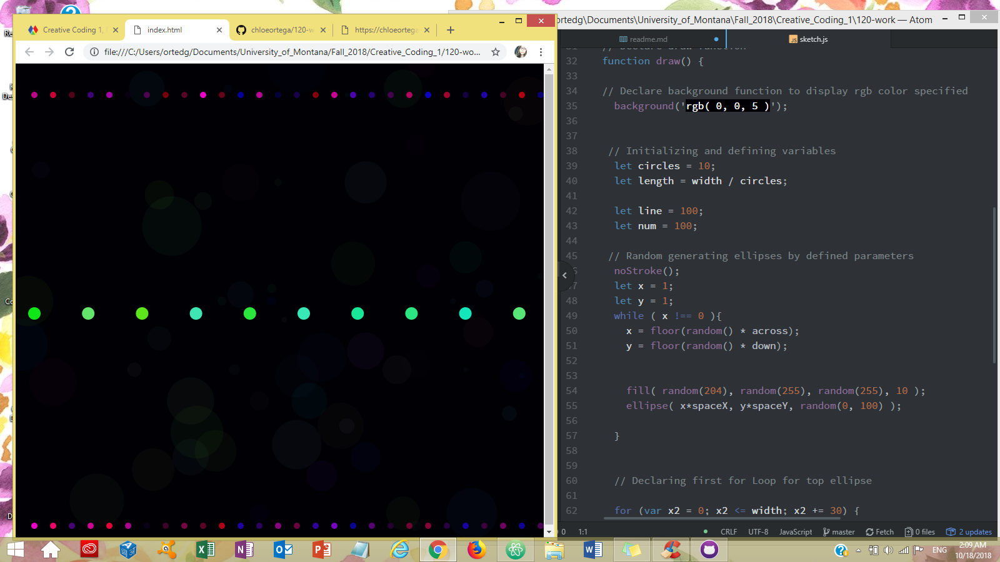

# Chloe Ortega, Group C

[Game Aesthetic Intro](https://chloeortega.github.io/120-work/hw-8/)

## Homework 8 Cycle Breakdown

### *Introduction*

This week the class focused on *for loops* and *while loops*, our assignment was to utilize the new material into a sketch that was interesting for us. The sketch I made this week reminded me of an old school tv game show aesthetic like on *The Price is Right*. In order to accomplish this I read through the material, practiced by using the javascript boxes, and taking more time to play with functions. My sketch is created using *for loops* and *while loops*, `random()`function, `floor()`function, `ellipse()` function, and declaring my `background` function in the `draw()` function. This week we also learned more about the differences declaring our variables using **let** and **var**.

### *Issues*

This homework cycle I came across a few minute problems in my coding, but the biggest problem for myself was trying to come up with a concept. In order to inspire some creative flow I did the following:

- View some more of Daniel Shiffman's YouTube videos on coding
- Used the p5.js Reference page for practice
- Invested more time in working on ideas I had thought about previous to this week

I ended up creating an old school game show intro aesthetic that I would like to use in developing a small game of some sort, maybe like a matching game.

### *Work*

Below is a sample of my code and a screenshot of my final sketch.

### Progress and Final Thoughts

This week I was less than thrilled with the outcome of my sketch, I am still continuing to try to be nice to myself. Unfortunately, I was not able to help anyone in this weeks class issue forum, but I shall try to help next time if I have a better grasp on what I am trying to accomplish first in my sketch. Overall I need to try harder and keep practicing, next homework cycle will be better.
